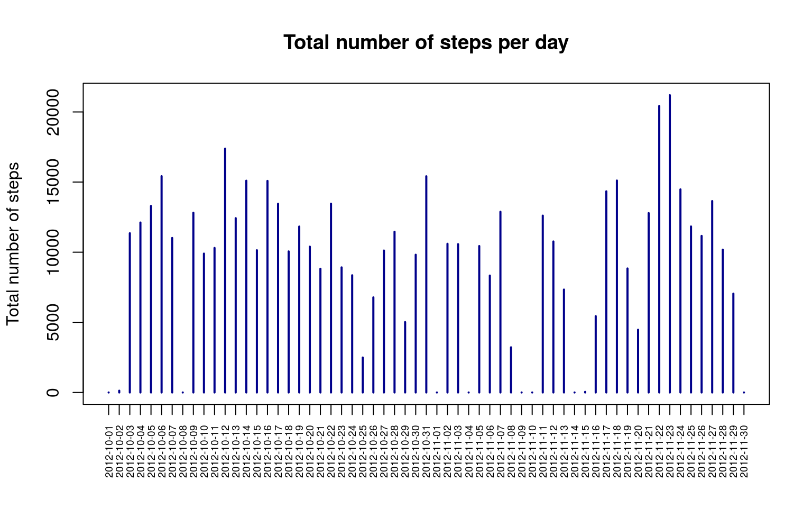
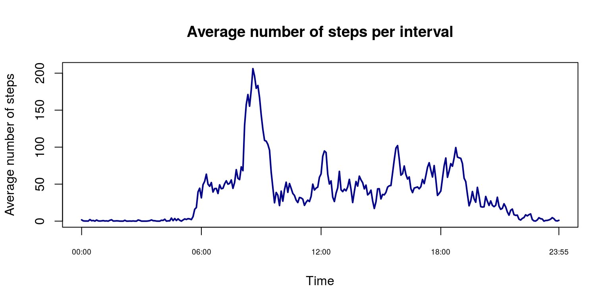
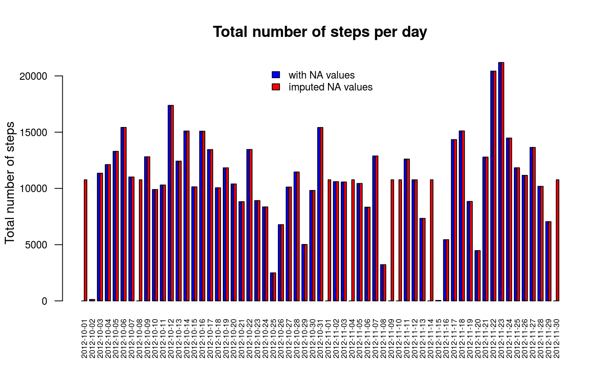
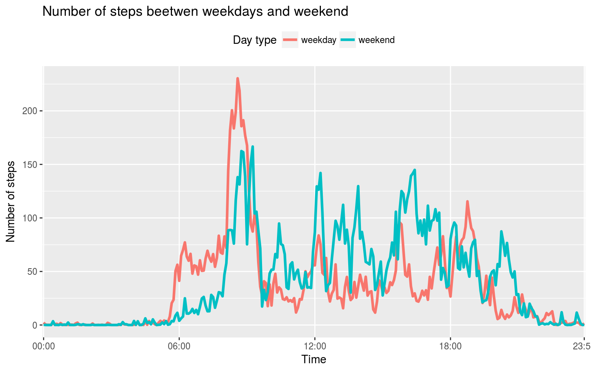

In this report, I describe the steps to analyze a dataset including the
physical activity, given in number of steps taken in 5 minute intervals
each day, of an anonymous individual during two months (October-November
2012). Through different steps, I will answer to different questions
using the information provided in the dataset.

Loading and preprocessing the data
----------------------------------

I downloaded the dataset from the Course web: [Activity monitoring
data](https://d396qusza40orc.cloudfront.net/repdata%2Fdata%2Factivity.zip)

I load the dataset, which is stored in *comma-separated-value (CSV)*
format:

    activity<-read.csv("activity.csv",header=TRUE, quote = "\"")
    str(activity)

    ## 'data.frame':    17568 obs. of  3 variables:
    ##  $ steps   : int  NA NA NA NA NA NA NA NA NA NA ...
    ##  $ date    : Factor w/ 61 levels "2012-10-01","2012-10-02",..: 1 1 1 1 1 1 1 1 1 1 ...
    ##  $ interval: int  0 5 10 15 20 25 30 35 40 45 ...

I convert the date variable from factor to a date format

    activity$date<-as.Date(activity$date, format="%Y-%m-%d")
    str(activity$date)

    ##  Date[1:17568], format: "2012-10-01" "2012-10-01" "2012-10-01" "2012-10-01" "2012-10-01" ...

I also convert the interval from integer to time (hours: minutes)

    int2 <- mapply(function(x, y) paste0(rep(x, y), collapse = ""), 0, 4 - nchar(activity$interval))
    int <- paste0(int2,activity$interval)
    activity$interval<- format(strptime(int, format= "%H%M"), format ="%H:%M")

What is mean total number of steps taken per day?
-------------------------------------------------

    totalSteps<-tapply(activity$steps, activity$date, sum, na.rm=TRUE)
    plot(totalSteps, type = "h", col="darkblue", xaxt="n", ylab="Total number of steps", lwd=2, xlab="", main="Total number of steps per day")
    axis(1,at=1:61,labels=names(totalSteps), las=2, cex.axis=0.6)

    meanSteps<-round(mean(totalSteps),digits = 2)
    medianSteps<-median(totalSteps)

The mean steps per day was **9354.23** and the median **10395**

What is the average daily activity pattern?
-------------------------------------------

    maxInterval<-names(averageSteps[averageSteps == max(averageSteps)])

The time with highest activity is 08:35

Imputing missing values
-----------------------

    naCount<-length(which(is.na(activity$steps)))

In the dataset there is a total of *2304 NA values*.

To fill in the NA value, I will replace each NA value for the mean of
that 5-day interval, creating the new variable *steps2*

    for (i in 1:nrow(activity)) {
    if (is.na(activity$steps[i])){
    int<-activity[i,3]
    activity$steps2[i] <- averageSteps[as.character(int)]
    }
    else { activity$steps2[i] <- activity$steps[i]}
    }
    head(activity)

    ##   steps       date interval    steps2
    ## 1    NA 2012-10-01    00:00 1.7169811
    ## 2    NA 2012-10-01    00:05 0.3396226
    ## 3    NA 2012-10-01    00:10 0.1320755
    ## 4    NA 2012-10-01    00:15 0.1509434
    ## 5    NA 2012-10-01    00:20 0.0754717
    ## 6    NA 2012-10-01    00:25 2.0943396

    totalSteps2<-tapply(activity$steps2, activity$date, sum)
    steps<-rbind(totalSteps,totalSteps2)
    barplot(steps,beside = TRUE, col =c("blue","red"), xlab="", ylab="Total number of steps",main="Total number of steps per day", cex.axis=0.8, cex.names=0.6, las=2)
    legend("top",c("with NA values","imputed NA values"), fill = c("blue","red"), cex = 0.8,bty = "n")

    meanSteps2<-round(mean(totalSteps2),digits = 2)
    medianSteps2<-median(totalSteps2)
    stepsMatrix<-matrix(c(meanSteps, meanSteps2,medianSteps,medianSteps2),nrow=2,ncol=2,dimnames=list(c("means","medians"),c("with NA","imputted NA")))
    library(knitr)
    kable(stepsMatrix)

<table>
<thead>
<tr class="header">
<th></th>
<th align="right">with NA</th>
<th align="right">imputted NA</th>
</tr>
</thead>
<tbody>
<tr class="odd">
<td>means</td>
<td align="right">9354.23</td>
<td align="right">10395.00</td>
</tr>
<tr class="even">
<td>medians</td>
<td align="right">10766.19</td>
<td align="right">10766.19</td>
</tr>
</tbody>
</table>

There is difference in the mean but not in the of total number steps
between the datasets.

Are there differences in activity patterns between weekdays and weekends?
-------------------------------------------------------------------------

    activity$day<-weekdays(activity$date)
    weekday<-c("lunes","martes","miércoles","jueves","viernes")

    daytype = character()
    for (j in 1:nrow(activity)) {
      if (activity$day[j] %in% weekday) {
        daytype[j] =  "weekday" 
        } else { daytype[j] = "weekend"}
      }
    activity<-cbind(activity,daytype)

    averageStepsbyDay<-tapply(activity$steps2, list(activity$interval, activity$daytype), mean, na.rm=T)

    library(reshape)
    averageStepsMelted<-melt.array(averageStepsbyDay, varnames=c("interval","daytype"))

    library(ggplot2)
    ggplot(data=averageStepsMelted,aes(x=interval,y=value, group=daytype)) + geom_line(aes(color = daytype), size = 1.2) + theme(legend.position = "top") + xlab("Time") + ylab("Number of steps") + scale_x_discrete(breaks=c("00:00","06:00","12:00","18:00","23:55")) + labs(title="Number of steps beetwen weekdays and weekend", color ="Day type")

